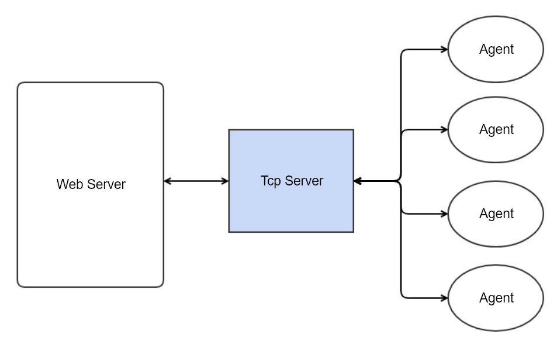

# BAScope: tcp-server

## Introduction
사이버 공격 시뮬레이션 서비스인 `BAScope` 에서 웹 서버와 에이전트 사이에서 중개하는 역할을 하는 Relay 서버이다.  
여러 Agent 와의 연결을 관리하고, 웹 서버로부터 명령을 받아 타겟 Agent 에게 명령을 분배해준다. 또한, Agent 에게 받은 결과를 정제하여 웹 서버로 전송하는 역할까지 수행하고 있다.


## Usage
- python3 가 설치되어 있어야 한다.
    - 일반적인 소켓 통신만 수행하기 때문에 관리자의 권한은 필요하지 않는다.


### Configuration
- 기본적으로 사용하는 포트나 웹 서버의 주소 등을 설정해주어야 한다.
- 기본 설정을 바꾸려면 config.py 에 등록된 값을 수정하면 된다.


### Run
```bash
python3 main.py
```
- Agent 나 웹 서버로부터 연결이 이루어지면 동작하기 시작한다.

## System Architecture

- 여러 Agent 들과 연결을 관리한다.
- 웹 서버가 내린 명령을 타겟에 맞게 적절히 분배하며, Agent 에서 포트 중복 등의 이슈를 해결하기 위해 자체적인 명령(Lock/Unlock)도 전송한다.
- Agent 로부터 명령에 따른 결과를 보고 받게 되고, 이를 정제하여 웹 서버에게 전달하게 된다.

## Technical Details
- 웹 서버의 구조를 단순하게 만들기 위해, 웹 서버와 Agent 를 중재하기 위해 만들어진 중개 서버이다.
- I/O Multiplexing 기술이 적용되어 싱글 쓰레드로 동작한다.
- 웹 서버와의 통신을 위해 소켓 통신과 HTTP 요청을 수행하며, Agent 와 상호작용을 위해서 소켓 통신을 사용하였다.
- 웹 서버와 같은 PC 에서 동작할 수 있도록 하였으며, Tcp Server 는 기본적으로 모든 Agent 와 통신이 가능해야한다.

